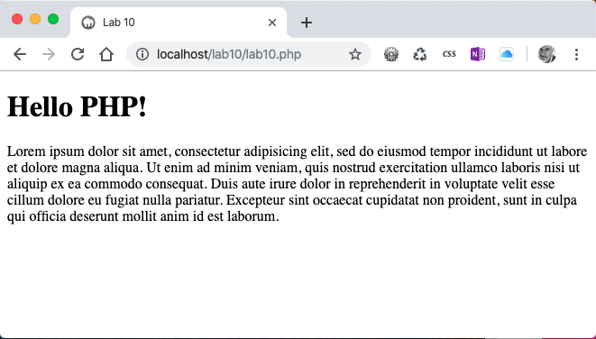
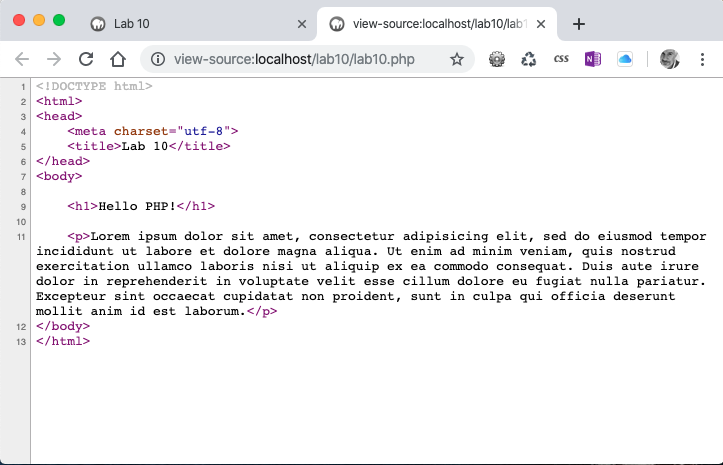

# Lab 10: Localhost
*Due: Tuesday, October 22, 2019*

The point of this lab is to simply demonstrate that you can setup and work with a "localhost" which is required for using PHP. 

*Note: this lab is different from all previous labs - it's pass/fail, and all you have to do is demonstrate to a TA that you're able to run a server and use a localhost to create a simple "include."  After you show this to any of the TAs,  they will check you off for credit. There is nothing to upload to the class web server nor turn-in on Blackboard.*

## Step 1: Installation

All university lab computers have **MAMP for Windows** installed so you can use them if you don't want to (or can't) install software on your own computer, but keep in mind:

- All CSC 170 labs from now on will require you use PHP code so you'll need to use a *localhost* for every lab for the rest of the semester
- Also beware!  All university lab computers are wiped clean every time you logout so do **not** think you can save your lab files there and come back later!  They'll be gone.

If you are okay installing a software on your personal computer (recommended):

- Pick a WAMP or MAMP (or LAMP?) software bundle - options were presented in the recent lecture
- Download and install the stack onto your computer as shown in the recent lecture

Also be aware: if you can't get the software to work on your computer, the professor will *try* to help you figure it out in your lab, but there's no guarntee he can get it to work.  So if need be, you'll have to use the university computers.  They definately do work.  

## Step 2: Launch the Software; Find Your *localhost*

- [ ] Launch (i.e. start) the software bundle you installed (or start "MAMP" on any of the university lab computers)
- [ ] Open a web browser to "localhost"
- [ ] In the file system of your computer find the directory (folder) of your "web root"
  - If there are existing files in the web root you may delete them, or move them out to look at them later (they won't be needed for CSC 170)

## Step 3: Create a Demonstration

- [ ] In your web root, create an HTML document with the **.php** file extension, e.g. **demo.php**, **lab10.php** ...it doesn't matter - just make sure it ends with **.php**

- [ ] Add a normal HTML5 document structure (doctype etc.) to the file

- [ ] In the BODY tag, add some content - not much, just something like an H1 or something like this: `<h1>Hello PHP!</h1>`

- [ ] Under your little bit of content in the BODY tag, enter a "PHP Include" statement like this: 

  ```php+HTML
  <?php include "content.php"; ?>
  ```

  NOTE: the filename "content" can be whatever you want

- [ ] Then create another file in the same directory; name the file **content.php** (or whatever you used in the *include* statement above)

  - Do **not** fill this other file with an HTML5 document structure! Start with it blank

- [ ] In the new file, add some plain text - lorem ipsum or whatever
  
  - You can use whatever HTML tags you want - like a P tag to wrap around your lorem ipsum text ...whatever makes sense
- [ ] Save and close your files

Then check your handiwork in your web browser, pointed to http://localhost. Navigate to your webpage (the first file you created) and you should see something like this:



You should see both the HTML page with the H1 **and** the lorem ipsum text

If you just see the H1 **or** just the lorem ipsum text, then you did it wrong

- One more thing: open the *source view* of that webpage.  Notice that you'll see *no* PHP code!  You'll just see the combined HTML code like this...




## Step 4: Get Credit

- [ ] Call over one of the TAs and tell them you're ready to do your Lab 10 demonstration
- [ ] In front of a TA, tell them your name (so they can find you in their list) and...
  - Show them the web root folder on you computer - it should have two files in it
  - Show them the contents of the two files in a code editor like Sublime Text
  - Show them your web browser open to localhost so they can see the compiled webpage

That's it!  If it all works correctly the TA will give you credit for this lab